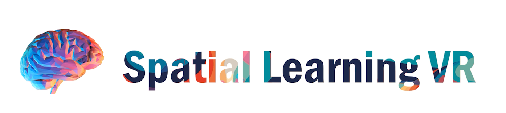
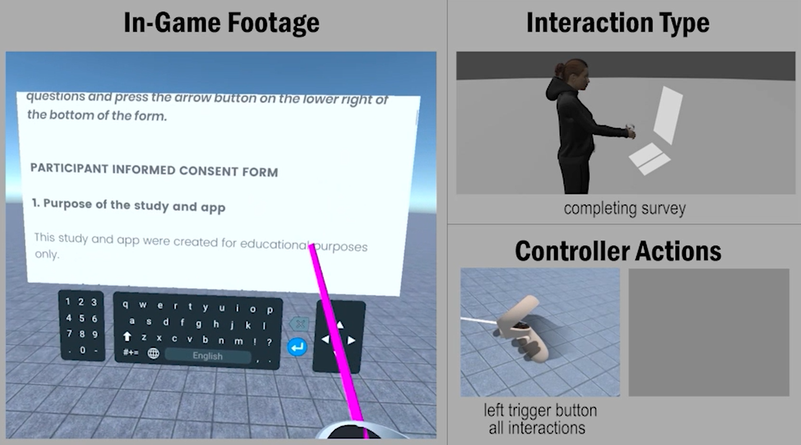
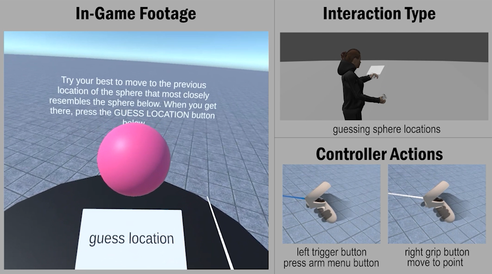

### Spatial Learning VR is a virtual reality app that measures your spatial learning ability.

### You can view a video description of this project by clicking on this link: https://youtu.be/DkEK3AnuKng

### You can also view a test subject tutorial by clicking on this link: https://youtu.be/cUQCahuN0lQ

 

