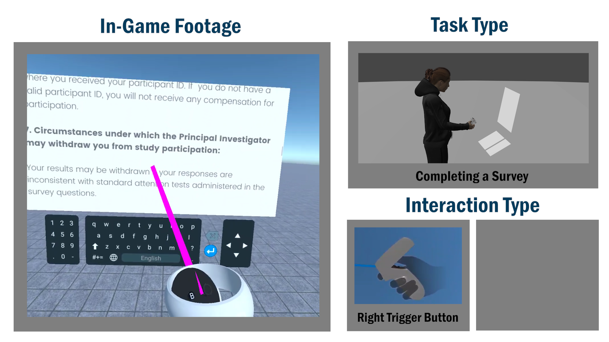
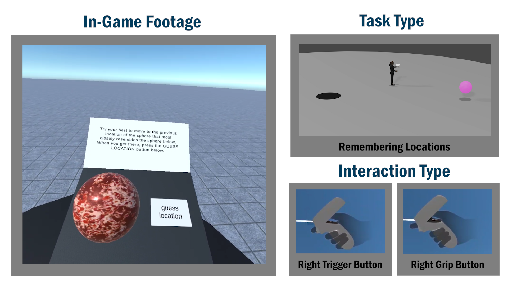

### Spatial Learning VR is a virtual reality app that measures your spatial learning ability.

### You can view a video description of this project by clicking on this link: https://youtu.be/vDKivj1zEwI

 

